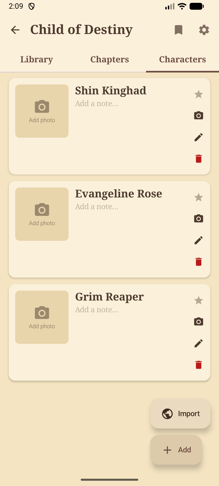

# NovelReader

**A novel reader for Android that works 100% offline.**

Import novels from the web or from HTML/MHT files you already have, read comfortably, bookmark where you stopped, search across all chapters, and keep character sheets — all without needing internet after import, no signup, no tracking, no cloud.

> Portuguese version: [README_PT.md](README_PT.md)

---

## What it's for

NovelReader is for people who read a lot of web novels / light novels and want to:

- **Read offline** — import once, read anywhere (subway, plane, no signal). Chapters stay on your device.
- **Not depend on a specific site** — if the site goes down, changes its URL, or puts up a paywall, your library stays intact.
- **Manage a large library** — full-text search, sort by title / date / last read, filter by status, chapter and bookmark counts.
- **Keep track of characters** — for novels with many characters (xianxia, fantasy), create sheets with photos, notes, and favorites.
- **Customize the reading experience** — light or dark theme, font size, line height, auto-scroll.
- **Not be tracked** — no analytics, no account, no proprietary server. Everything is local.

---

## What you can do

### Import novels

- **From the web** — paste a novel URL from a supported site; the app discovers the chapter list, downloads the content, and organizes everything. Downloads run in the background with a progress notification.
- **From local files** — pick HTML or MHT files using Android's file picker. Useful for novels you've already saved from elsewhere.
- **Auto-update** — novels with a source URL can be checked periodically; new chapters are downloaded on their own.

### Read

- Six palettes (Indigo, Paper, Graphite, Forest, Plum, AMOLED) plus the system dynamic color on Android 12+
- Your own accent color, for the app and for the reader separately
- Adjustable font size, line height, and auto-scroll
- Each chapter remembers where you stopped (even if you kill the app)
- **Full-text search** — find a word or phrase across all chapters of a novel
- Bookmarks with notes — mark important passages

### Make it yours

- **Wallpaper for the library** and a **separate wallpaper for the reader** — pick your own image or one of the built-in gradients
- Blur each wallpaper to taste
- **Reading veil** — control how much of the reader background sits between the text and the wallpaper, so a photo never costs you legibility
- Themes chosen in the reader can follow the app or be pinned to a light/dark variant
- **Saved themes** — keep up to five looks (palette, accent colours and reader theme) and switch between them; switching never touches your wallpaper
- **Reset appearance** — one button puts palette, accents, wallpapers, blur and veil back to the defaults, keeping your saved themes

### Organize characters

For novels with many characters, each novel has a **Characters** tab where you can:
- Create sheets with name, photo, notes
- Add multiple photos per character (gallery)
- Favorite the main ones
- Import ready-made sheets from the MVLEMPYR site (a character database partnership)

### Check what went wrong

When an import fails (URL down, error page instead of content, corrupted file), the app:
- Saves the failed chapter in the database
- Shows it in the novel's "Failed chapters" tab
- Lets you **retry the download** (if the URL is back) or **import an MHT file manually** for that chapter
- Also detects chapters with empty or missing content (by scanning for chapter numbers)

---

## How to use

1. **Install the APK** (see the build section at the bottom or download a release)
2. **Open the app** — the home screen shows your library
3. **Tap the "+"** to import a novel
4. **Choose the source**:
   - **Web**: paste the novel URL → select the chapters → import starts
   - **Files**: select HTML/MHT files from your device
5. **Tap the novel** in the library to see its chapters
6. **Tap a chapter** to start reading
7. **Use the chapter menu** to favorite, mark as read, or view bookmarks

The **Characters** tab appears when you select a novel. The **Favorites** tab (in the top menu) shows all your bookmarks in one place.

---

## Privacy

- No analytics, telemetry, or tracking
- No account or login
- No proprietary server — the app sends nothing anywhere
- Web imports use only HTTPS and the URL you provide
- All data (novels, chapters, bookmarks, characters, photos) stays on your device

---

## Languages

Portuguese (default) and English. Configurable in **Settings**.

---

## Screenshots

| Library | Reader | Characters |
|---|---|---|
|  |  |  |

---

## Supported web import sites

- **FreeWebNovel**
- **ReadNovelFull**
- **Any HTML page** (generic parser)

For novels from sites not listed, the generic parser tries to extract the main content. It works well on sites with a simple structure.

---

## Version history

### v2.10.0 (2026-09-14)

- Feat: six palettes (Indigo, Paper, Graphite, Forest, Plum, AMOLED) with a light/dark variant each, replacing the plain light/dark/dynamic choice; dynamic color becomes one of the palette options.
- Feat: editable accent color for the app and, separately, for the reader — the app derives a readable tone for the chosen hue/saturation instead of letting a bright accent wash out the UI (verified against every palette background).
- Feat: wallpapers — one for the library and one for the reader, each with its own blur, either your own image (copied into app-private storage, never in the backup) or one of eight built-in gradients.
- Feat: reading veil slider (default 80%) plus a per-reader palette and light/dark variant, so the wallpaper never wins over the text.
- Fix: the reader settings sheet now scrolls; with the new sections the bottom half was unreachable on a phone.
- Legacy reader themes (`light`, `dark`, `sepia`, `gray`) map exactly onto the new palettes, so existing readers keep their colours.
- Feat: up to five saved themes (palette, accent colours and reader theme) plus a one-tap appearance reset that keeps them.
- Fix: sliders persisted on every drag frame — and the reader re-applied its CSS over the JS bridge for each of them — so the thumb stuck and jumped; values now commit once, on release.
- 637 unit tests passing (was 506).

### v2.9.3 (2026-09-14)

Dependency hardening, reader theming and accessibility:

- **Reader**: the settings sheet has an **Auto** theme chip, so the reader follows the app theme again after you pick a colour (before, that choice was unreachable without clearing app data)
- **A11y**: the theme chips are announced as radio buttons instead of generic checkable views
- **Security**: `jsoup` 1.22.1 → 1.23.2, clearing CVE-2026-71497 (the advisory only triggers for safelists that allow raw-text elements, which `READER_SAFELIST` never did); the parser fixtures pass unchanged
- **Security**: the landing-page build toolchain advisories are patched in the lockfile
- **Docs**: the residual-risk registry records why migrating the reader's JS bridge to `addWebMessageListener` would not reduce risk in this app

No data migration required.

### v2.9.2 (2026-09-09)

Security hardening from an external audit, plus reader fixes:

- **Security**: backup import is hardened against CSS/JS injection through `fontFamily`, against SSRF on restored `sourceUrl` values (loopback, private and link-local hosts are rejected) and against arbitrary `photoPath` values
- **Security**: site parsers match hosts exactly, and notification deep links carry a per-install token
- **Security**: the reader WebView uses a per-load CSP nonce (no `unsafe-inline`), the Cloudflare challenge validates the host before loading it, private DNS answers are blocked and response bodies are capped at 8 MiB (16 MiB decompressed)
- **Reader**: chapter title back at the top of the content (duplicate source headings are deduped), always-visible top bar, bottom status bar with the battery level, options bar on a single tap
- **Reader**: config, bookmark and theme changes apply to the open page without reloading it, and the chapter that was loaded before process death is restored (it used to return to a stale chapter)
- **Fix**: `http://` chapter links on an `https` page are upgraded instead of being rejected
- **Feat**: the reader theme follows the app theme by default

No data migration required.

### v2.9.0 (2026-08-23)

Collections and complete backup:

- **Collections**: create and pin collections and add novels to them from the novel menu
- **Backup v3**: exports novels (author, total chapters, auto-update, last read chapter), bookmarks and characters, and now also collections and settings; a pending restore is applied once the background download finishes
- **Import**: settings-only imports are supported, and local-only novels are reported as not restorable
- **Database**: Room v11 → v12 (`folders`, `novel_folder`)

Room migrates automatically (v11 → v12).

### v2.7.5 (2026-08-23)

Reader and library polish:

- **Reader**: toggle the controls with a short press; the chapter-list sheet scrolls to the current chapter; a source heading that duplicates the chapter title is stripped
- **Library**: the novel badge shows the new-chapter count, falling back to a dot
- **Import**: novels queued for background import show as "Waiting to import" until they land

No data migration required.

### v2.7.0 (2026-08-20)

- **Reader**: controls toggle on a long press, reverse chapter order in the list, and the live scroll position is captured through JS so returning from a chapter resumes correctly
- **Library**: "What's New" sheet on app open when chapters were added
- **Internal**: the `LibraryIntent` dispatcher was replaced with direct ViewModel calls; dead code removed
- **Database**: Room v10 → v11 (`chapters.isNew`)

Room migrates automatically (v10 → v11).

### v2.6.0-fix (2026-08-04)

Reader swipe fixes:

- A vertical swipe only changes chapters at page boundaries
- The previous chapter resumes at the end again after a swipe up

No data migration required.

### v2.6.0 (2026-08-02)

Favorites, targeted cancel and import fixes:

- **Library**: favorite novels (3-dot menu toggle and filter) and selective JSON backup
- **Import**: per-novel queue with targeted cancellation of background jobs
- **Reader**: directional entrance transition when changing chapters by gesture, and the correct scroll position restored across navigation
- **Fix**: a `StackOverflowError` crashed the reader on every swipe (bridge callback fields shadowed the annotated methods)
- **Fix**: FreeWebNovel imports the full chapter list (it only got the first 40), and covers are written as exact binary bytes
- **Database**: Room v9 → v10

Room migrates automatically (v9 → v10).

### v2.5.4 (2026-07-17)

- **Reader**: configurable swipe direction (vertical, horizontal, both or none), empty-chapter state with MHT recovery, re-import of an MHT/HTML file into an existing chapter, and reader errors surfaced with a Retry action
- **Library**: visible 3-dot menu on cards, a "Chapters" entry, inline HTTPS validation in the cover dialog, and no more accidental character deletion by swipe
- **Notifications**: tapping an import notification opens the failed-chapters section and scrolls to it
- **Haptics**: standardized (long press only)

No data migration required.

### v2.5.3 (2026-07-10)

Import reliability:

- "Retry all" re-enqueues every failed chapter
- Retries with backoff and explicit rate-limit (429) classification, 5 s pacing, and rejection of empty or stale content

No data migration required.

### v2.5.2 (2026-06-30)

Multi-source import and per-source update checks:

- **Import**: a novel can have several sources, and the update check iterates all of them
- **Library**: blue dot and chapter-count badge when a novel has new chapters
- **Parsers**: FreeWebNovel's new layout, the ReadNovelFull chapter archive, and per-domain list augmentation
- **Cloudflare**: cookies are persisted per domain and the challenge host check covers any domain
- **Fix**: 404 pages are no longer captured as chapter content
- **Database**: Room v8 → v9 (`novel_sources`, `hasUpdates`)

Room migrates automatically (v8 → v9).

### v2.4.3 (2026-06-26)

UI/UX polish and infrastructure:

- **Reader**: chapter list in the bottom sheet now wraps to 4 lines (was 1)
- **Library**: empty state with illustration and "Add your first novel" CTA
- **Library**: "Reading" badge now shows relative time (e.g. "Lendo · há 2 h")
- **Library** and **Chapters**: scroll position is remembered between visits (per-novel for the chapters tab)
- **Personagens tab**: ExtendedFAB with labels for Add and Import actions
- **A11y**: contentDescription audit of 42 icon-only buttons (0 functional changes needed)
- **Haptics**: light haptic feedback on bookmark add, FAB tap, and tab switch
- **i18n**: complete English translations (all pt-BR keys mirrored in `values-en`)
- **Dynamic color**: opt-in toggle in Settings (Android 12+)
- **Tab transitions**: 220ms slide between library, reader, and settings
- **Test infrastructure**: Compose UI test base (Robolectric)

No data migration required.

---

## What's next

See `git log` for the history of architectural improvements and the `handoff-*.md` files (gitignored) for the current project state.

---

# Technical section

<details>
<summary>Details for developers</summary>

## Stack

| Component | Version |
|---|---|
| Kotlin | 2.2.10 |
| AGP | 9.2.1 |
| Jetpack Compose (BOM) | 2024.12.01 |
| Material 3 | (via Compose BOM) |
| Hilt | 2.59.2 |
| Room | 2.8.4 |
| KSP | 2.3.9 |
| Jsoup | 1.23.2 |
| Coil | 2.7.0 |
| DataStore | 1.1.3 |
| WorkManager | 2.10.0 |
| Min SDK | 26 (Android 8.0) |
| Target SDK | 34 (Android 14) |
| Compile SDK | 35 |
| JVM | 17 |

## Architecture

MVVM + UseCase + Hilt DI, with unidirectional flow:

```
Compose -> ViewModel -> UseCase -> DAO
                        |-> Parser (Set<NovelParser> via Hilt multibinding)
```

- ViewModels expose `StateFlow` for UI state and `SharedFlow<String>` for errors
- `ChapterFetcher` and parsers are injected via multibinding; `GenericFallbackParser` is the catch-all
- Background imports via WorkManager (SEQUENTIAL and PARALLEL modes)
- `DeepLinkBus` connects update notifications to navigation
- Room v8 database with 7 entities, 5 DAOs, FTS4 for search
- `ChapterOrderNormalizer` reorders chapters by number after import
- `RetryChapterUseCase` and `ScanMissingChaptersUseCase` for failure recovery

## Project structure

```
app/src/main/java/com/novelreader/
  MainActivity.kt                       Single Activity; handles deep links
  NovelReaderApp.kt                     @HiltAndroidApp, WorkManager config
  di/                                   Hilt modules (Database, Parser, Storage, Work, Dispatchers)
  data/
    local/db/                           Room: 7 entities, 5 DAOs, FTS4, 8 migrations
    local/preferences/                  DataStore (App, Reader, Import, Library)
    parser/                             HTML/MHT parsers (Hilt multibinding)
    storage/                            CoverStorage (file I/O)
    remote/                             MvlempyrCharacterImporter
    worker/                             WorkManager workers
  domain/usecase/                       Business logic
    webimport/                          ChapterCrawler, ChapterFetcher, CoverDownloader, NovelImporter
    importnovel/                        FileCharsetDetector, NovelGrouper, ChapterSorter, ChapterInserter
    RetryChapterUseCase, ScanMissingChaptersUseCase, ChapterOrderNormalizer
  ui/
    navigation/                         NavGraph + DeepLinkBus
    library/                            Tabs: novels, chapters, characters
    reader/                             WebView with bookmarks and search
    import_novel/                       Local import screen
    webimport/                          Web import screen
    favorites/                          All bookmarks
    settings/                           Theme, language, queue mode
    theme/                              Colors, typography
  util/                                 LocaleHelper
```

## Build

```bash
./gradlew :app:assembleDebug            # Debug APK
./gradlew :app:installDebug             # Install on connected device
./gradlew :app:compileDebugKotlin       # Compile only (fast)
```

## Tests

```bash
./gradlew :app:testDebugUnitTest            # JVM tests (no emulator needed)
./gradlew :app:connectedDebugAndroidTest    # Instrumented tests (emulator needed)
./gradlew :app:compileDebugKotlin :app:testDebugUnitTest  # Before committing
```

| Suite | Type | ~Count |
|---|---|---|
| Reader (view model, HTML builder, sheet, theme) | Unit | 137 |
| Parsers | Unit | 78 |
| Use cases + web import | Unit | 143 |
| Library / chapter list / settings screens | Unit | 55 |
| Preferences, storage, theme and customization | Unit | 87 |
| Workers, navigation, favorites, misc | Unit | 96 |
| **Total (JVM)** | | **637** |

`./gradlew :app:testDebugUnitTest` runs the whole JVM suite; the DAO suite below needs an emulator.

More details in [`README-TESTES.md`](README-TESTES.md).

## Database

Room v8. 7 entities (`Novel`, `Chapter`, `Bookmark`, `Character`, `CharacterPhoto`, `FailedChapter` + `ChapterFts`). 8 manual migrations. FTS4 over `chapters.title` and `chapters.content`.

## i18n

`pt` (default) and `en`. Configurable at runtime via `AppPreferences` (DataStore). Language switch recreates the Activity.

## Contributing

See [`CONTRIBUTING.md`](CONTRIBUTING.md) for detailed guidelines.

## License

MIT — see [`LICENSE`](LICENSE).

</details>
