# NovelReader

**An Android novel reader that keeps your library on your device.**

Import a novel once, then read it offline anywhere. NovelReader has no account, no analytics, no tracking, and no proprietary cloud service.

> Versão em português: [README_PT.md](README_PT.md)

## Download

Download the latest APK from [GitHub Releases](https://github.com/fabriciof807/NovelReader/releases).

Requires Android 8.0 or newer.

## What you can do

### Import and keep reading offline

- Import a novel from a supported website or from HTML/MHT files already on your device.
- Download chapters in the background and follow the progress from a notification.
- Optionally check web-imported novels for new chapters.
- Keep your chapters even if the original website changes, goes offline, or adds a paywall.

### Read your way

- Resume every chapter where you stopped.
- Search words and phrases across all chapters of a novel.
- Add bookmarks with notes.
- Adjust font size, line height, auto-scroll, palette, reader theme, and accent colour.
- Choose a wallpaper or built-in gradient separately for the library and the reader; crop, blur, and veil it for comfortable reading.
- Save up to five colour themes without changing your wallpapers.

### Organize your library

- Sort and filter novels by title, date, reading state, favourites, chapters, and bookmarks.
- Create collections for your novels.
- Keep character sheets with notes, photos, and favourites.
- Back up and restore your library, bookmarks, characters, collections, and settings as JSON.

### Recover from failed imports

If a chapter cannot be imported, NovelReader records the failure and lets you retry the URL, import an MHT file manually, or dismiss the item. It can also find missing chapter numbers and chapters with empty content.

## How to use

1. Install the APK from [Releases](https://github.com/fabriciof807/NovelReader/releases).
2. Open the app and tap **+** in the library.
3. Choose **Web** to paste a novel URL, or **Files** to select HTML/MHT files.
4. Select the chapters to import.
5. Open the novel in the library, then choose a chapter to read.

The **Characters** tab is available inside each novel. Your bookmarks are collected in **Favorites**.

## Privacy

- No account, analytics, telemetry, tracking, or proprietary server.
- Your library, chapters, bookmarks, character data, photos, and settings stay on your device.
- The app contacts a website only when you choose a web import or update check.
- The optional MVLEMPYR character importer contacts that service only when you start an import from it.

## Languages

Portuguese (default) and English. Change the language in **Settings**.

## Screenshots

The app's interface is in Portuguese, its default language. These are placeholders taken on an
emulator and will be replaced.

### Library

| Library | With a wallpaper | Graphite (dark) | AMOLED |
|---|---|---|---|
| 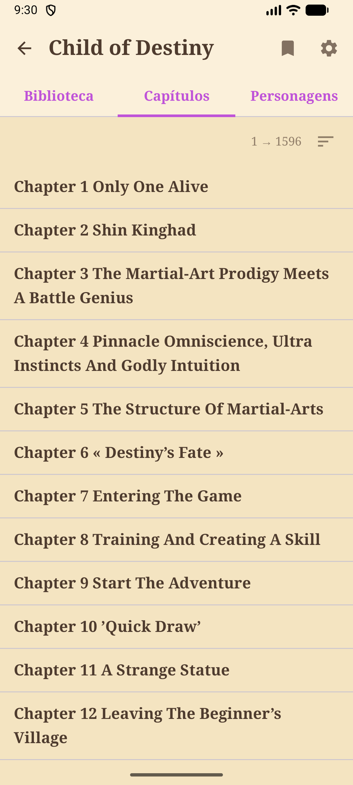 | 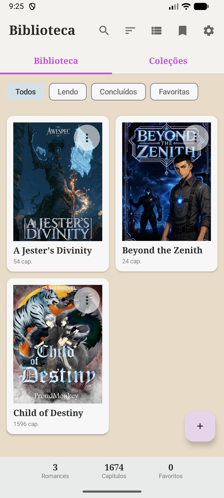 | 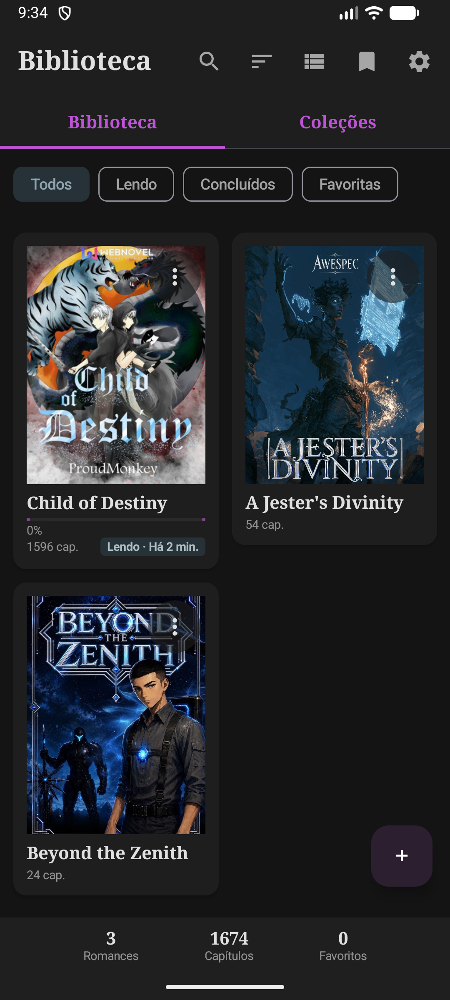 | 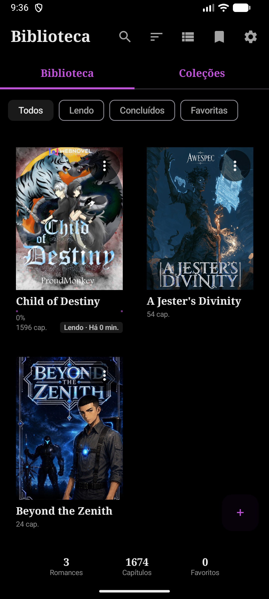 |

### Reading

| Reading | Reading in AMOLED |
|---|---|
| 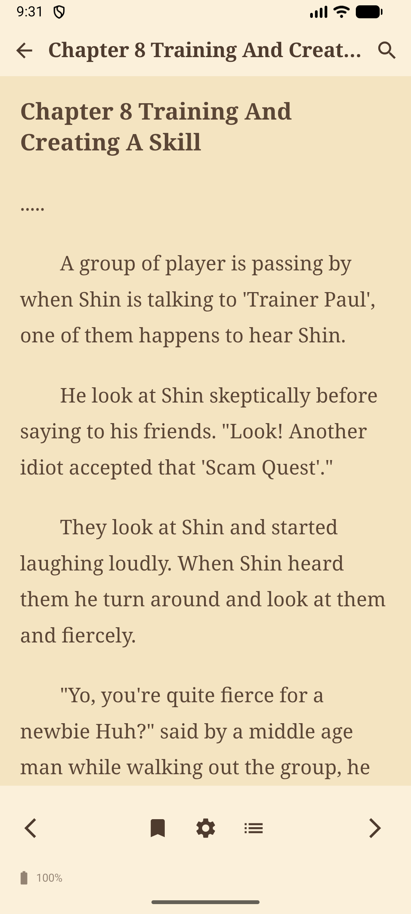 | 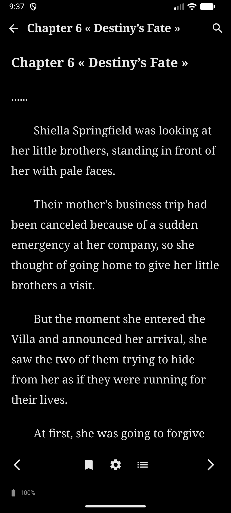 |

### Characters and collections

| Characters | Collections | Novel menu |
|---|---|---|
| 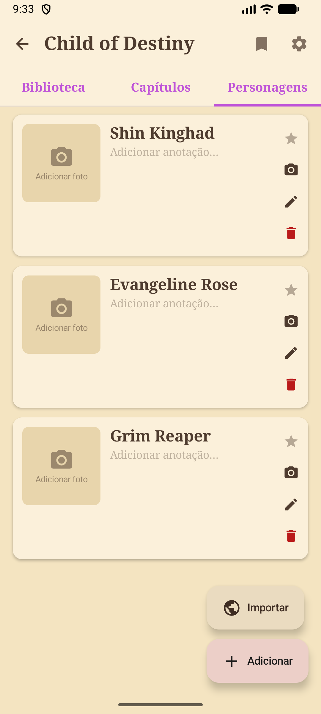 | 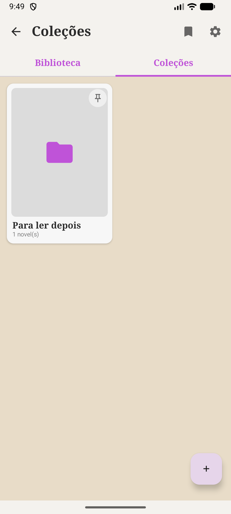 | 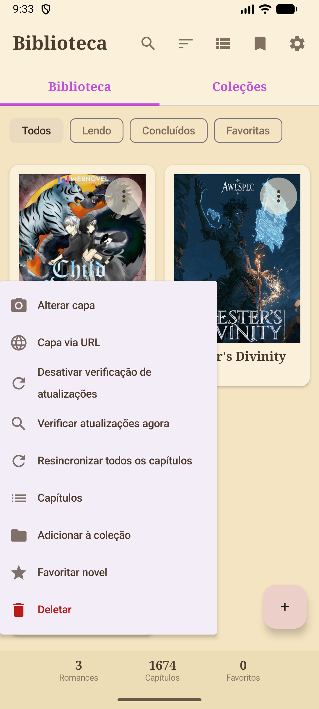 |

### Appearance

| Settings | Colors and theme | Wallpaper | Theme, dark palette |
|---|---|---|---|
| 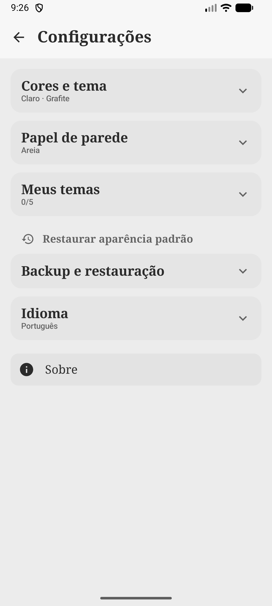 | 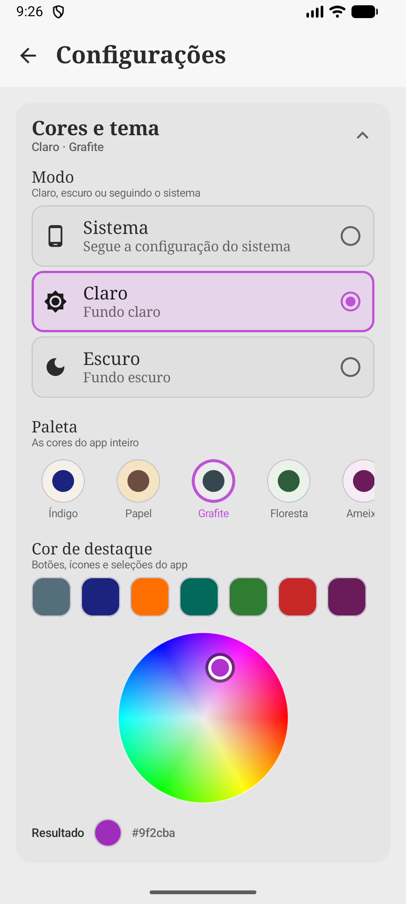 | 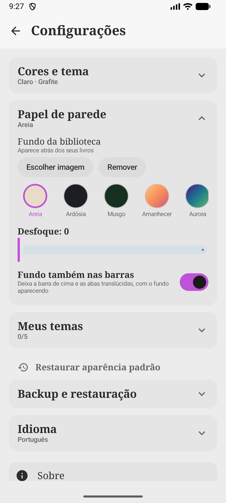 | 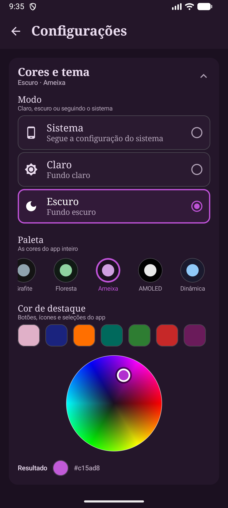 |

## Supported web sources

- [FreeWebNovel](https://freewebnovel.com/)
- [ReadNovelFull](https://readnovelfull.com/)
- Other HTML pages through the generic parser, when their structure is compatible

## Latest release

### v2.11.0

- Library controls automatically match a light or dark wallpaper for consistent, readable text.
- Chapters become visible in the library while a web import is still running.
- Safer and more reliable web imports.

See [Releases](https://github.com/fabriciof807/NovelReader/releases) for the complete changelog.

## Contributing

Want to help develop NovelReader? Read [CONTRIBUTING.md](CONTRIBUTING.md).

## License

[MIT](LICENSE)
